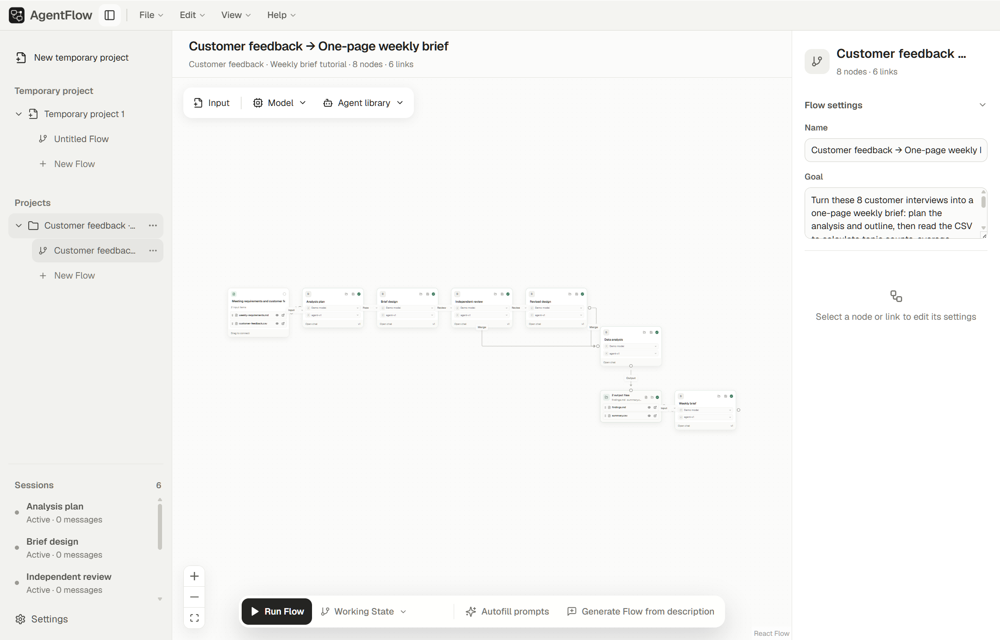

<div align="center">
  <picture>
    <source media="(prefers-color-scheme: dark)" srcset="docs/assets/brand/chuanshengtong-wordmark-panel.svg">
    
  </picture>
  <h1>传声筒 AgentFlow</h1>
  <p><strong>面向 LLM 与编程 Agent 的可视化多智能体工作流桌面应用</strong></p>
  <p>连接不同模型，分配各自角色，把 Agent 之间的对话变成可用的文件成果。</p>
  <p><a href="README.md">English</a> · <strong>简体中文</strong></p>
  <p><a href="#功能特色">功能特色</a> · <a href="#快速开始">快速开始</a> · <a href="#ai-native-skill">AI-native skill</a> · <a href="docs/cli.zh-CN.md">CLI 文档</a> · <a href="#连接你的模型">模型连接</a></p>
  <a href="LICENSE"></a>
</div>

**传声筒 AgentFlow** 将模型 API 和本地编程 Agent 汇集到一个桌面工作台中。在画布上搭建流程，让一个 Agent 审阅另一个的工作，并把最终成果保存在自己的项目文件夹里。



## 功能特色

- **设计 Agent 之间的协作。** 通过 Pass、Review、Revise、Merge 连接传递、审阅、修订与汇总步骤。独立分支可以并行运行，回复实时呈现。
- **为每个角色选择模型。** 将常用 LLM 与 Codex、Claude Code 等编程 Agent 组合在同一个流程中。
- **与任意 Agent 对话。** 双击节点打开它的会话，继续追问、讨论并完善结果。
- **描述任务，生成 Flow。** 检查建议流程后应用，用自动填写 Prompt 帮助编写各个 Agent 的指令，并锁定想保留的内容。
- **带着文件开始工作。** 添加文本、PDF、Word 文档、CSV 和模型支持的图片；选择下游可见的内容，阅读 Markdown 结果并复用输出文件。
- **保存好用的 Agent。** 将角色、Prompt 和模型设置存入 Agent 库，留给下一次任务使用。
- **在自己的文件夹中管理成果。** 一个 Project 可以组织多个 Flow，对话与结果保存在本地。界面支持中文、English 和跟随系统。

## 可以用它做什么

| 任务 | 工作流示例 |
| --- | --- |
| 撰写与编辑 | 初稿 → 独立审阅 → 修订 |
| 比较想法 | 多个专业视角并行分析 → 汇总建议 |
| 整理报告 | 原始材料 → 分析 → 报告 |
| 处理数据 | 编程 Agent 处理 CSV → 撰写 Agent 生成简报 |

每个 Agent 都有自己的模型、指令和会话。你可以检查每一步的工作，再决定向后传递哪些内容。

## 快速开始

打开 [GitHub Releases](https://github.com/v1xerunt/AgentFlow/releases)，按电脑类型下载安装包。桌面应用自带运行时。独立安装的 [Skill](#ai-native-skill) 使用编程 agent 提供的 Node 环境，或由安装脚本配置专用运行时。

| 你的电脑 | 应下载的文件 | 安装方式 |
| --- | --- | --- |
| Windows x64 | `AgentFlow-<版本>-windows-x64-setup.exe` | 双击运行安装向导 |
| M 系列芯片 Mac，macOS 13 或更新系统 | `AgentFlow-<版本>-mac-mchip-arm64.dmg` | 打开后将 AgentFlow 拖入“应用程序” |
| Linux x64 | `AgentFlow-<版本>-linux-x64.AppImage` | 赋予执行权限后运行 |
| Debian / Ubuntu x64 | `AgentFlow-<版本>-linux-x64.deb` | 使用系统软件包安装器打开 |

Mac 的 ZIP 用于自动更新；`.yml`、`.blockmap` 是更新清单和辅助文件。首次使用请选择上表中的安装包。

安装完成后：

1. **体验引导教程。** 跟随客户回访工作流生成周会简报。教程使用预设演示回复，无需 API Key。
2. **连接模型。** 打开设置，添加模型 API、连接账户，或配置本地 Agent 工具。
3. **创建 Project。** 添加输入文件和 Agent，连接它们的角色；也可以描述任务来生成 Flow。
4. **运行并完善。** 查看执行过程，双击 Agent 继续对话，打开最终生成的文件。

### 检查与自动更新

打开 **设置 → 应用更新**，查看当前版本、手动检查更新，或调整自动检查与下载开关。两个开关默认开启：启动后检查一次更新；下载完成后，在保存工作并退出应用时安装。也可以点击 **退出并安装更新**。

Windows 安装版、Linux AppImage 和经过签名的 macOS 构建支持自动安装。其他构建可通过页面中的 Release 入口下载并手动安装。更新器只获取已经正式发布且包含配套更新清单的版本，草稿版本不会推送。

### 从源码启动

安装 [Node.js](https://nodejs.org/) **22.13 或更高版本**，然后在仓库目录运行：

```sh
npm ci
npm run dev
```

## AI-native skill

[AgentFlow skill](skills/agentflow/SKILL.md) 让 Codex、Claude Code 直接生成并执行 Flow。说出目标，编程 agent 就能规划流程，使用当前会话的模型和工具完成各个角色的工作：

> 分析这些客户反馈，审阅分析的证据，最后生成行动建议。请自动生成并运行 Flow，再给我一个可编辑面板。

- **从意图生成 Flow。** Skill 提供流程格式和关系语义，让 agent 根据需求编写明确的角色、提示词与依赖。
- **使用当前 Agent 会话。** 各个角色直接继承宿主的模型和工具，无须额外配置服务商。宿主支持时可以分配给原生子 agent，也可以在单个会话中按角色顺序执行。
- **检查过程并恢复运行。** JSON CLI 校验流程、分配就绪任务，记录完成结果和来源依赖，中断后可以从保存的状态继续。
- **通过对话或面板编辑。** 让 agent 调整流程，或在本地 HTML 面板中修改目标、输入、提示词和关系标签，导出后开始新运行。

直接对编程 agent 说：**“给我安装 https://github.com/v1xerunt/AgentFlow 这个 Skill。”** 它会按照[安装流程](skills/agentflow/references/installation.md)，按确定的目录提交 SHA 下载完整 Skill，并自动配置 Node，优先使用宿主提供的运行时。轻量 Skill 支持创建和执行 Flow、保存结果、导出离线 HTML 面板；需要完整交互编辑器时再下载桌面应用。

从源码安装时，在仓库执行 `npm ci` 后运行：

```sh
npm run skill:build
node scripts/install-skill.mjs --host both --project "/path/to/your/project"
```

只安装一个宿主时使用 `--host codex` 或 `--host claude`；个人安装用 `--user` 替换 `--project`。安装器会保留已有安装。`skills/agentflow` 包含配套 CLI 和许可文件，安装脚本会配置 Node.js 22.13+ 并记录命令路径，保持系统 PATH 不变。详见 [CLI 安装说明](docs/cli.zh-CN.md#构建与安装)。

每次 Skill 任务开始时，脚本检查一次 `main` 上 `skills/agentflow` 目录的变化。有新版时提供更新命令；断网或超时则静默使用本地版本。更新 Skill 会一起替换指令和配套 CLI，并保留用户配置。桌面应用与 Skill 各自管理版本。

在项目中使用 Codex 的 `$agentflow` 或 Claude Code 的 `/agentflow`，后面接要执行的任务。Skill 引导 CLI 调用，宿主完成实际推理和工具操作。直接使用命令行时，可以从[执行示例](docs/cli.zh-CN.md#使用宿主-agent-运行-flow)开始。

### Instructions for LLMs

可以直接对编程 agent 说：

> 读取 https://github.com/v1xerunt/AgentFlow/tree/main，按照 README 的 Instructions for LLMs，把 AgentFlow skill 安装到我当前的项目。

用户请求安装时，按以下步骤操作：

1. 阅读[安装与运行时配置](skills/agentflow/references/installation.md)。查询 `main` 上最近影响 `skills/agentflow` 的提交，并按该 SHA 下载完整目录。
2. 为当前宿主和用户指定的项目安装；未指定项目时使用个人 Skill 目录。运行 Windows 的 `scripts/setup.ps1` 或 macOS/Linux 的 `scripts/setup.sh`，传入 SHA。宿主提供 Node 时传入其路径，否则由脚本检测或下载专用 Node 到用户目录。
3. 安装脚本校验示例并返回 `valid: true` 后再报告成功，说明已安装 SHA、运行时、Skill 目录和 `$agentflow` / `/agentflow` 调用方式。Skill 使用自己的命令更新，完整桌面编辑器作为独立下载提供。

安装位置遵循 [Codex 的 skill 目录](https://learn.chatgpt.com/docs/build-skills#where-codex-loads-local-skills)和 [Claude Code 的 skill 目录](https://code.claude.com/docs/en/skills#where-skills-live)。

## 连接你的模型

需要为不同角色选择服务商和模型时，在桌面应用中配置以下连接：

| 连接方式 | 可选服务或工具 |
| --- | --- |
| 模型 API | OpenAI、Anthropic、Google Gemini、DeepSeek、Z.AI、Z.AI GLM Coding Plan、Kimi / Moonshot、OpenRouter |
| 自定义端点 | OpenAI 兼容、Anthropic、Gemini API |
| 本地 Agent 工具 | Codex、Claude Code、Kimi Code、Antigravity、DeepSeek Harness |
| 账户连接 | ChatGPT / Codex、Claude Code、Kimi、Gemini / Antigravity |
| 实验连接 | DeepSeek Web Bridge |

使用你自己的 API Key 或受支持的账户。API 与订阅账户分别配置，适用各服务商的账户和用量要求。本地 Agent 工具使用各自的安装环境与权限。

项目保存在你的文件夹中。运行已连接的模型时，选中的提示词和文件会发送给对应服务商或 Agent 工具。Linux 保存 API 凭据需要可用的系统钥匙环。

## 文档

- [CLI 使用文档](docs/cli.zh-CN.md)：安装、宿主执行、JSON 响应、中断恢复、可视化面板与演示命令。
- [Flow 规范](skills/agentflow/references/flow-spec.md)：流程结构、关系语义与宿主模式支持的输入。
- [AgentFlow skill](skills/agentflow/SKILL.md)：编程 agent 用于生成和执行 Flow 的完整指令。

## 许可证

AgentFlow 采用 [GNU AGPLv3](LICENSE) 开源许可证。第三方组件保留其[各自许可](THIRD_PARTY_NOTICES.md)。
